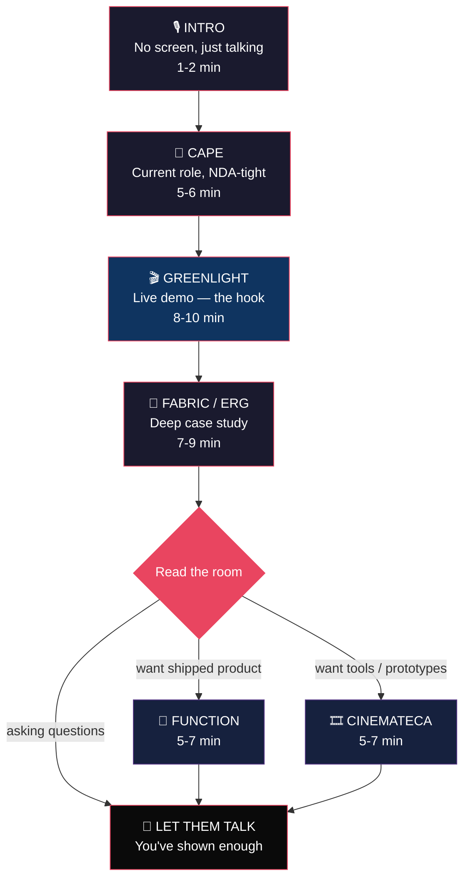
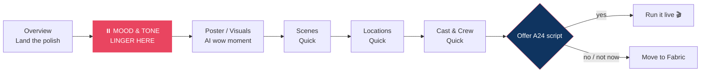
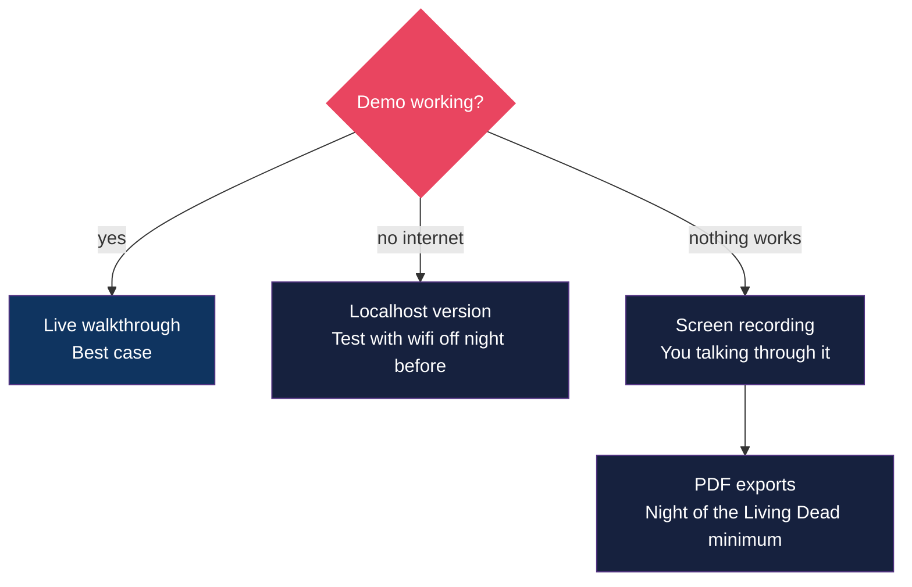
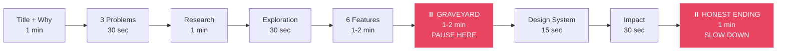
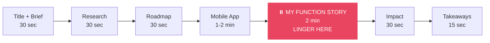
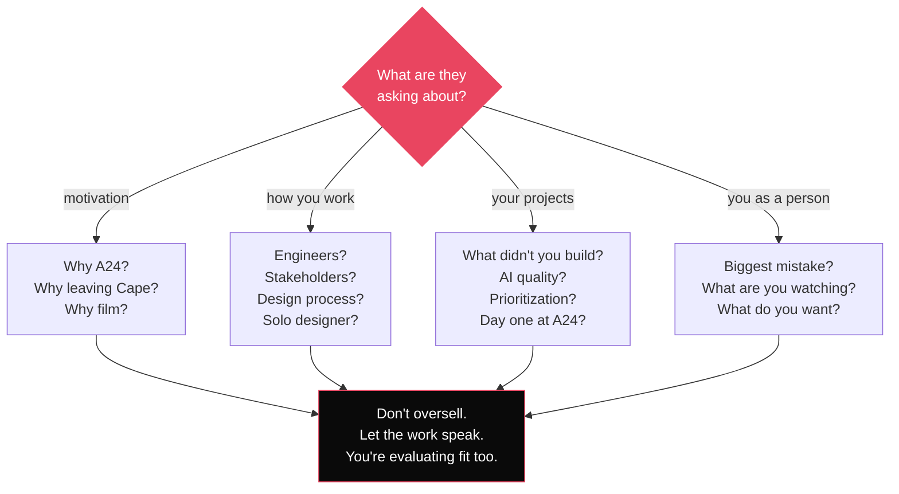

# A24 Labs — Presentation Guide

**Format:** 45-60 min portfolio review
**Audience:** 2-3 people, design background
**Target:** ~25-30 min presenting, rest is conversation
**Rule:** Never jump ahead in a PDF. Scroll down, never up.

---

## Flow

| Block | Min | Max | Notes |
|-------|-----|-----|-------|
| Intro | 1 | 2 | No screen. Camera/eye contact only. 90 sec max. |
| Cape | 5 | 6 | NDA = premium, not thin |
| Greenlight | 8 | 10 | The energy peak. Let them react. |
| Fabric / ERG | 7 | 9 | Scroll steady, pause on Graveyard + ending |
| Branch (Function OR Cinemateca) | 5 | 7 | Only if they want more |
| **Presenting total** | **26** | **34** | |
| **Conversation / Q&A** | **11** | **34** | The more the better |

If you hit 30 min of presenting and haven't started the branch piece — skip it. You've shown enough. Let them talk.

---

## Section 1 — Intro (1-2 min)

**No screen.** Camera only (video call) or laptop off to the side (in person). They should be looking at you, not a screen. Share screen when you transition to Cape.

> "I've been designing for about 15 years. First decade was mostly freelance — different industries, helping founders go from idea to prototype, working with engineers to ship it. After COVID I got more deliberate about where I spent my time — healthcare, then privacy, and on the side I've been building tools for film. I'll walk you through a few of those."

If the energy is right, add before transitioning: "If there's one thread across everything I'll show you — it's that the best design decisions are usually the ones where you say no."

~20 seconds. Then: "Let me share my screen" → Cape.

### Convictions (weave into each section, not the intro)

- **Through-line:** "I don't design products I haven't used." — Cape (live with it daily), ERG (went to the ER), Function (signed up as a member), Cinemateca (user zero). Say it once early, then every later instance reinforces the pattern.
- **Constraint-as-innovation:** Every project has a constraint story — Cape (NDA = mystique), Greenlight (LoRA = sketch aesthetic), ERG (Graveyard = saying no), Function (brand restraint = one thread motif). Let this emerge naturally, don't label it.
- **Cape:** privacy, personal ownership, building the opposite of data-point startups
- **Fabric:** post-COVID, wanted problems you lose sleep over because you care
- **Function:** reaction to bad healthcare incentives, letting people own their data
- **Why I'm looking now:** (only if asked) biggest AI transformation, want to be in it

---

## Section 2 — Cape (5-6 min)

**Show:** Cape PDF (title card + Obscura/Echo screenshots)
**Goal:** Establish what you're doing now. The NDA does the heavy lifting.

| Step | Cape version |
|------|-------------|
| **What it is** | Network-layer privacy platform — two products, one system |
| **Why it exists** | Every startup turns users into data points. Cape builds the opposite. |
| **How you approached it** | Think in primitives, not products. One system, four skins. *(NDA limits detail)* |
| **What was hard** | No access to users → products turn into bloat. Telephone-game feedback. |
| **What happened** | TIME Best Inventions 2025. $100M Series C. |
| **What you carried forward** | Without direct user access, you can't force simplicity. You need to see what's not being used. |

### What to say

Share screen. Cape PDF on screen.

- "I've been at Cape for the past year. I joined because I was growing more and more concerned about privacy and personal ownership — every startup turning users into data points. Cape is building the opposite of that."
- Two products: **Obscura** (Android app) and **Echo** (web app)
- Privacy at the **network layer**, not the app layer. Most privacy tools protect *what* your phone does. Cape protects *how* it identifies itself
- Flat org, very close to engineering, wore many hats
- "I live with the product every day — and the hardest part is I can't talk to the people who do too."
- One of the hardest parts: total disconnection from the people using the product. No direct feedback — everything is a telephone game. I like to build products, talk to the people using them, iterate, learn, proactively deliver value. That's hard when your users are privacy-minded by definition and the entire goal is for their work to be invisible.
- Without direct user access, products turn into bloat. You keep adding features based on secondhand feedback but you never know what's not being used, what you need to remove, where to force simplicity. That's the cost.
- **Obscura was named to TIME's Best Inventions of 2025.** $100M Series C.
- Can't show much because of NDA, but a couple of screens and a story about the design philosophy

### Talking points

1. **"A privacy product for the people who can't afford a mistake."** — journalists, survivors, high-risk individuals
2. **"One system, four products."** — same primitives, four skins via feature flags. Think in primitives, not products.
3. **"The product is a remix, not a rewrite."** — same architecture could host accounting, scouting, production, distribution
4. **"Designing for the constraint, not around it."** — one device family, not a product choice — a physics choice

### What to show

- 2-3 screenshots of Obscura (two-device mockup + 1-2 UI screens)
- 2-3 screenshots of Echo (plan detail with map + devices table + detail sheet)
- Keep it to 3-4 min of showing, let the NDA mystique do the rest

### NDA boundaries

**CAN say:** company name, product names, category, Series C, TIME award, your role, aesthetic, who it's for abstractly
**CANNOT show:** UI flows, internal dashboards, feature details, client names, deployment counts

### Why you're leaving (only if asked)

Highly regulated, moves slow by necessity. Biggest AI transformation in a generation — want to be in it, not watching from a secure building.

### Transition to Greenlight

> "So that's the day job. Now let me show you something I built on my own — it's the reason I'm sitting here."

---

## Section 3 — Greenlight (8-10 min)

**Show:** Live app (localhost:3001 or greenlight-app-red.vercel.app)
**Goal:** This is the hook. Film + AI + taste + "I built this." Turn the review into a conversation.

| Step | Greenlight version |
|------|-------------------|
| **What it is** | Script-to-vision-deck generator for film pre-production |
| **Why it exists** | Built for my wife — she spent hours doing manual work to get from script to something tangible |
| **How you approached it** | Live demo replaces narration — show, don't tell |
| **What was hard** | AI output quality. Constrained images to sketch aesthetic so they read as concept art, not final output. |
| **What happened** | It works. Show it live. |
| **What you carried forward** | "Imagine what an entire team in the industry can build." |

### The opening (use these exact words)

> "You just got a script. Where do you start?"

> "I built this for my wife. She was spending hours doing manual work with scripts trying to get to something tangible — locations, mood, references, scope. So I built her a tool that does it in minutes.
>
> I can show you how it works. I already have Night of the Living Dead processed — here's what you get, what you can edit, and how you export it.
>
> If you want, we could try it live with an A24 script — but I didn't want to upload anything to Gemini without checking with you first."

### Demo walkthrough (Night of the Living Dead pre-loaded)

Walk through tabs. ~1 min per tab, linger on Mood & Tone. 5-min target for the walkthrough itself.

1. **Overview** — "This is what you get. Logline, synopsis, themes, scope — all generated from the screenplay data." Lands the polish immediately.
2. **Mood & Tone** — LINGER HERE. "This is the tab I'm proudest of. Color palette, atmosphere, tonal references, soundtrack direction. This is where the tool stops being a summarizer and starts being a creative conversation." This is the most important tab for this audience.
3. **Poster Concepts / Visuals** — "These are generated with FLUX and a LoRA that makes everything look like hand-drawn storyboard sketches. Every asset comes out looking like the same artist drew it." The AI wow moment.
4. **Scenes** — "Scene-by-scene with inline storyboard frames. You can group by sequence or location."
5. **Locations** — Quick pass. "Unique locations with set requirements."
6. **Cast & Crew** — "Characters with AI portraits plus production insights."
7. **Then the A24 offer:** "By the way — we could try it with one of your scripts if you want."

### Quotable lines

1. **"Film tools shouldn't look like accounting software."**
2. **"The tool is deliberately unfinished in the right places."** — sketch aesthetic = concept art, not "AI image"
3. **"Narrow audiences are a design luxury."** — one user, one problem, freedom to say no

### The close

> "This is a weekend prototype I kept polishing for days. I cant imagine what an entire team in the industry can build."

### If they ask "how did you get here?" (iteration story)

"The first version looked like a spreadsheet with pictures. The LoRA constraint solved that — it gave everything one voice. That's when it stopped being a prototype and started being a product."

### If they ask technical questions

- Next.js, React 19, Claude Haiku 4.5 (docs), FLUX dev + Gesture Draw LoRA (images via fal.ai), Claude Sonnet (PDF extraction), TMDB API (references)
- One LoRA = visual consistency by design, not prompt engineering

### Demo fallback plan (if things break)

If the live demo dies, don't panic: "Let me show you the output instead" → video + PDF exports. The work speaks either way.

### A24 bonus round

Scripts pre-cached. Demo is instant. "I happened to prepare a couple ahead of time."
Candidates: EEAAO, The Witch, Ex Machina, Hereditary, Moonlight, The Lighthouse

### Transition to Fabric

> "OK — let me show you something different. This is a case study from a couple years ago, and it's probably the project I learned the most from."

---

## Section 4 — Fabric / ERG (7-9 min)

**Show:** ERG.pdf — scroll top to bottom, never jump
**Goal:** Depth, honesty, point of view. This is the "this person thinks differently" piece.

| Step | ERG version |
|------|------------|
| **What it is** | Emergency Room Guide — app for the hardest room in the hospital |
| **Why it exists** | Post-COVID, wanted problems you lose sleep over because you care |
| **How you approached it** | Went to the ER. Walked the patient journey. Did a shift in pediatric ER. Then designed. |
| **What was hard** | The Graveyard — killed 3 features that sounded helpful but created liability or false confidence |
| **What happened** | 5,700 patients, 3 hospitals, 19-min reduction in length of stay |
| **What you carried forward** | "We had an impact. Just not the one we walked in hoping for." |

**How to present:** Don't read the text — they can see it. Narrate at a higher level while scrolling. Pause on key visuals. Keep moving through the middle. Slow down for the ending.

### Scroll map (follows the PDF order exactly)

**TITLE + WHY I TOOK THIS** (1 min)
- Scroll to: "Making an app for the hardest room in the hospital"
- "This was right after COVID. I'd been in fintech and I wanted the next thing to be closer to the kind of problem that keeps you up at night because you care, not because you're optimizing a funnel."
- "The company wanted to buy a hospital and rebuild it from first principles. Sole designer, product called ERG — Emergency Room Guide. The CEO's answer to 'where do we start?' was 'let's fix the ER.' That one sentence ended up being a reality check for everyone."
- (If it comes up later: the company evolved into more of a shop for health systems rather than reinventing them — that's part of the honest ending.)

**THREE PROBLEMS** (30 sec)
- Scroll to the 3 problem cards. Pause briefly.
- Anchor with a number first: "The average ER wait in the US is over two hours. We wanted to know what that time feels like."
- Then: "Three problems, all in the same waiting room. Patients had no signal in the chaos. Nurses had no time to capture context. Discharge had no next step."
- Don't elaborate — the cards say it. Keep moving.

**RESEARCH / ER VISIT** (1 min)
- Scroll to: "I went to the ER. Not as a designer — as a visitor."
- Say: "I couldn't design this from Figma. I spent time at the hospital, walked the full patient journey, did a shift in the pediatric ER."
- Pause on the 4 observations. Pick 1-2 to read aloud — these are the strongest:
  - *"Patients aren't anxious because of the wait. They're anxious because they don't know if the wait is working."*
  - *"The ER isn't a bad process. It's a chaotic one on purpose — people who are sicker cut the line, and that's exactly how it should work."*

**EXPLORATION + FLOW MAPPING** (30 sec)
- Scroll through the exploration screens at a steady pace.
- Say: "Wide exploration, then I collapsed it into a single product flow the whole team could hold in their head. We had too many cross-team dependencies to sit in the same room, so everything had to be reviewable asynchronously."
- Don't stop on every screen. Keep scrolling.

**SIX FEATURES** (1-2 min)
- Scroll to: "Six features, each tied to something we saw."
- Say: "Every feature traces back to an observation from the hospital. I didn't want a feature list — I wanted a chain of decisions I could point to later."
- Pause on two:
  - **EHR Integration** — "We prefilled intake from the EHR — shifted from 'type it again' to 'is this still right?' That single shift changed the emotional tone of the first three minutes."
  - **Adaptive Visit Timeline** — "The single most important screen. It answered the question nobody was asking out loud: am I still on the list?"
- Scroll through the rest without stopping.

**THE GRAVEYARD** (1-2 min) — PAUSE HERE
- Scroll to: "What we killed — and why killing it was the design decision."
- Say: "This is the section I'm proudest of. Three features that made the whiteboard and none of them made it into the app."
- Hit two:
  - **Predictive Wait Times** — "We wanted to show an estimate. The ER refused to behave. The same patient who should be seen in 20 minutes could be bumped three times by an incoming stroke. We chose honesty over precision — a timeline instead of an estimate."
  - **Optimized Treatment Plans** — "Showing patients a recommended next step sounds helpful until you ask who's making the recommendation, on what data, with what liability. This wasn't a design problem. It was a 'we shouldn't be building this' problem."
- Let it land. This is A24 territory — what you choose NOT to make.

**DESIGN SYSTEM** (15 sec)
- Scroll past quickly. "Built the design system white-label from day one — same patterns rolled into the pediatric ER with minimal rework."

**IMPACT** (30 sec)
- Scroll to the numbers. Pause.
- "5,700 patients across three hospitals. 19-minute reduction in length of stay. About 1,800 hours of ER time returned to the system."
- Then: "19 minutes is a strange number to celebrate against a two-hour ER wait."

**THE HONEST ENDING** (1 min) — SLOW DOWN HERE
- Scroll to: "We had an impact. Just not the one we walked in hoping for."
- Let them read the title for a beat. Then say in your own words:
- "The original thesis was to buy a hospital and rebuild healthcare from first principles. We didn't do that. The ER was supposed to be the proof — and it was, but it was also a lesson in how much you can actually move from the outside."
- If the energy is right: "The most important thing ERG did wasn't the 19-minute stat. It was the moment a patient looked at their phone, saw a timeline update, and the tension in their shoulders dropped. That's not on a dashboard."
- Let it breathe. Don't rush to the next thing.

### Transition — read the room

**If they want more shipped product work:**
> "I have another case study from Function Health — similar scale, different problem. Want to see it?"
→ Go to Section 5a (Function)

**If they're leaning toward tools/prototypes:**
> "I can show you Cinemateca — it's a film database I've been building for myself. 65,000 films, all the data, all the design, all the code."
→ Go to Section 5b (Cinemateca)

**If they start asking questions:**
→ Let them. You've shown enough. The conversation IS the rest of the interview.

---

## Section 5a — Function Health (5-7 min)

**Show:** Function.pdf — scroll top to bottom
**Goal:** Prove you can ship at scale within an established brand. The "yes I also do normal product design at scale" piece.

| Step | Function version |
|------|-----------------|
| **What it is** | Proactive health platform — 100+ lab tests turned into insights |
| **Why it exists** | Growing faster than the product could keep up. Web-only, no sharing surface. |
| **How you approached it** | Signed up as a member. Walked the full journey before opening Figma. |
| **What was hard** | Brand restraint — no illustrations, no celebratory motifs. "A type system, a color, and restraint." |
| **What happened** | 40K+ paying members, 5M biomarkers tested, $298M raised the following year |
| **What you carried forward** | Growth loops start as design decisions. Brand restraint is an invitation, not a limit. |

### Scroll map (follows the PDF order exactly)

**TITLE + BRIEF** (30 sec)
- The "why" is already covered in the intro. Just bridge: "This is Function Health — the proactive health platform I mentioned."
- "First thing I did was sign up as a member. Booked a lab visit, did the blood draw, waited for results. Before touching Figma, I wanted to feel what 40,000 members feel."
- "Personalized medicine platform — 100+ lab tests, then the app turns results into insights. Not just an app — a hybrid product. Physical lab experience + digital platform."
- "By late 2023, Function was growing faster than its product could keep up with. Web-only, confusing post-lab experience, no sharing surface. The #1 support ticket was 'where am I in the process?'"

**RESEARCH** (30 sec)
- Pause on the user quotes. Pick 1-2:
  - *"I got my results and then just sat there. What am I supposed to do now?"*
  - *"I keep having to email support just to figure out where I am in the process."*
- "We reframed the mobile app from 'phone version of the web dashboard' to 'an app that tells you where you are and what to do next.'"

**SHAPING THE ROADMAP** (30 sec)
- Scroll through the feature cards at a steady pace.
- "30+ ideas explored. I prototyped enough of each to make it discussable — a screen, a label, a hook."
- Don't stop on individual cards. Keep moving.

**MOBILE APP** (1-2 min)
- Pause on the app screens.
- **Visit Timeline** — "Same pattern as ERG, actually — the biggest support-ticket driver was 'where am I in the process?' — so we gave them a single screen with every step visible."
- **Home & Biomarkers** — "Results aren't the product — the 'what now' is."
- Scroll through walkthrough and login.

**MY FUNCTION STORY** (2 min) — LINGER HERE
- "This was my favorite part of the project. Function had lab results — arguably more personal than Spotify Wrapped — and no sharing surface at all."
- "I proposed and led end-to-end the first shareable moment in the product."
- Pause on the visual exploration: "Function's brand was deliberately quiet — no illustrations, no celebratory motifs. We had a type system, a color, and restraint."
- Pause on the thread: "There was a single line motif buried on the marketing site. We pulled it out and made it the anchor of the whole visual system."
- Pause on the shareable cards: "Lab result to share in three taps. Every card carried attribution and a referral entry point. Function's first PLG loop."

**IMPACT + TESTIMONIAL** (30 sec)
- "40,000+ paying members, 5 million biomarkers tested, $298M raised the following year."
- Testimonial is there but don't stop for it — keep scrolling. The numbers do the work.

**TAKEAWAYS** (15 sec)
- "Three things I carried forward: run the product on yourself before the brief, brand restraint is an invitation not a limit, and growth loops start as design decisions."
- Done.

---

## Section 5b — Cinemateca (5-7 min)

**Show:** cinemateca.co (password: `cinemateca2026`) or localhost:5174
**Goal:** Obsession, range, taste. "This person lives and breathes film AND can build the whole thing."

| Step | Cinemateca version |
|------|-------------------|
| **What it is** | Film explorer for people who want to go deeper, not wider. 65K films, all cross-linked. |
| **Why it exists** | Neither Letterboxd nor IMDb was the tool I wanted. So I built one. |
| **How you approached it** | Designed it, built the data pipeline, wrote all the code. No team. |
| **What was hard** | Knowing when to stop — every data source opens three more. Scope discipline as a solo builder. |
| **What happened** | 65K films, 16K people, 173 lists, 1,600 festivals, 8,400 podcasts, 9,300 video essays. |
| **What you carried forward** | Curation scales better than algorithms when the material is good. |

### The pitch

> "Letterboxd is a social network. IMDb is a trivia encyclopedia. Both are great at their jobs. Neither is the tool I wanted when I cared about a film's cinematographer, its title sequence, or the canon its director spent a decade answering. So I built one."

> "A film explorer for people who want to go deeper, not wider."

### What to say

- "This is Cinemateca. I've been building it for about a year. 65,000 films, 16,000 people, 173 curated lists, 1,600 festival profiles, 8,400 podcast episodes, 9,300 video essays. All cross-linked."
- "I designed it, I built the data pipeline, I wrote all the code. No team. I'm user zero — every decision comes from using it every day."

### The four layers (if they ask "what makes it different?")

1. **Discovery** — anti-algorithm. Browse by mood, aspect ratio, camera, lens, film stock, color palette. Dimensions of taste, not recommendations.
2. **Craft** — title designers, soundtracks, poster agencies, VFX houses, camera/lens/stock data. What filmmakers care about.
3. **Curation** — 173 lists, 14 festival circuits, 12 award bodies. Every list is an editorial lens.
4. **Context** — every film cross-linked to 8,400 podcast episodes, 9,300 video essays, semantic tags.

### Pages to show (pre-load all tabs morning of — pick 3-4)

| Page | URL | Shows |
|------|-----|-------|
| About | `cinemateca.co/about` | Quick overview |
| Movie | `cinemateca.co/movie/603` | The Matrix — full detail |
| Person | `cinemateca.co/person/488` | Spielberg — filmography, awards |
| Festival | `cinemateca.co/festival/sundance` | Sundance — awards history |
| List | `cinemateca.co/list/tspdt-1000` | TSPDT 1000 — curated browsing |
| Screenings | `cinemateca.co/screenings` | NYC showtimes — live data |

> Only use pre-tested URLs. Other pages may load slowly cold.

### Quotable lines

- **"MUBI doesn't win by having more films than Netflix. It wins by having a short note under every film explaining why it matters. That's the model."**
- **"Curation scales better than algorithms when the material is good."**
- **"I became a database architect because no off-the-shelf tool could build this."** — Good answer to "how do you work with engineers?"

### The close

> "65,000 films. Built by one person. On weekends."

---

## Open Conversation — Q&A

### Prepped answers

**"Why A24 Labs specifically?"**
→ Film person who designs tools for complex workflows. A24 Labs is the intersection. "I didn't design a portfolio for A24. I designed a portfolio, and A24 is the shape it ended up making."
→ Also: tired of being the only designer. Want to work with other creatives in an industry that's fun.

**"Why are you leaving Cape?"**
→ Believe in the mission. Highly regulated, moves slow. Biggest AI transformation — want to be in it.

**"Why should we hire you?" (won't ask directly — but know the answer)**
→ Builder and doer. Will keep building these tools regardless. Looking for the right team, right cultural fit. It's not about speed anymore — it's about building the right things with experience and taste.

**"What's your experience with AI tools?"**
→ Greenlight (Claude + FLUX + LoRA), Cinemateca (mood tagging, recommendations). "AI is a knife, not a magic wand."

**"How do you work with engineers?"**
→ Cape (flat org, RFCs, feature flags as design tool), ERG (3 health systems), Function (mobile transition), Cinemateca ("I *am* the engineer")

**"Design process for internal tools?"**
→ JTBD interviews → low-fi wireframes → smallest reusable piece → ship happy path, design for the graveyard

**"Have you worked in film/entertainment before?"**
→ Cinemateca + Greenlight. "This isn't a pivot, it's a convergence."

### Questions about your work (practice these)

**"How did you decide what NOT to build?"**
→ The Graveyard. Killed features that sounded helpful but created liability or false confidence.

**"How do you think about AI output quality?"**
→ The LoRA choice. Constrained to concept art, not polished output. "AI should invite collaboration, not end the conversation."

**"How do you design for users you can't talk to?"**
→ Flip it: "I learned what happens when you can't." Every other project starts with using the product yourself or sitting next to the user.

**"How do you prioritize what to build next?" (Cinemateca)**
→ No PM, no sprints. Build what you wished existed last night. User = designer = fastest feedback loop.

**"How do you work without another designer?"**
→ Great at it AND tired of it. Want to be around other designers. Part of why you're here.

**"What would you want to understand before building anything at A24?"**
→ "Who's using the tools, what are they doing today, and where does it hurt." Watch before proposing.

**"Stakeholders who want different things?"**
→ Cape: four products, one system. Build the shared layer, disagree at the architecture level, not the feature level.

**"A design decision you got wrong?"**
→ Have one ready. Not the Graveyard (those were right calls). Something you shipped and later realized was wrong.

### Have nearby and ready

- ERG Figma file (separate tab — backup if they want deeper detail on Fabric)
- Any other case studies they might ask about (QuadPay, Palm, Aplazo)

---

## Things NOT to Say

- **"It's just a side project"** — Greenlight and Cinemateca are real products
- **"I'm a huge A24 fan"** — the work says it. Fans apply, professionals evaluate fit.
- **"I'd love this opportunity"** — you're evaluating fit too, not begging
- **"I built it with AI" / "I vibe coded it"** — AI is a tool in your stack, not your identity
- **"I can learn that"** — bridge instead: "I've done something similar with ___"
- **"I'm not an engineer"** — you built Cinemateca and Greenlight. You're technical.
- **"To be honest"** — implies everything else wasn't
- **Don't badmouth Cape** — structural observation, not a complaint
- **Don't oversell Greenlight** — "imagine what a team builds" is the frame
- **Don't fill silence** — silence after a strong point is a feature

---

## One-Liners to Memorize

If you forget everything else, land these:

1. **Opening:** "Too much information, not enough clarity. That's what I fix."
1b. **Intro thread:** "The best design decisions are usually the ones where you say no."
2. **Cape:** "A privacy product for the people who can't afford a mistake."
3. **Cape philosophy:** "One system, four products. The product is a remix, not a rewrite."
4. **Greenlight:** "I built this for my wife."
5. **Greenlight taste:** "Film tools shouldn't look like accounting software."
6. **Greenlight close:** "A weekend prototype I kept polishing for months. Imagine what a team builds."
7. **Fabric:** "We had an impact. Just not the one we walked in hoping for."
8. **Fabric Graveyard:** "This wasn't a design problem. It was a 'we shouldn't be building this' problem."
9. **Function:** "Brand restraint is an invitation, not a limit."
10. **Cinemateca:** "65,000 films. Built by one person. On weekends."
11. **Cinemateca philosophy:** "Curation scales better than algorithms when the material is good."
12. **Why A24:** "I didn't design a portfolio for A24. I designed a portfolio, and A24 is the shape it ended up making."
13. **Closing (if needed):** "Every project I just showed you started the same way — I sat with the problem before I opened the tool. That's the thing I'd bring here."

---

## Open Questions / Fact Checks

### Resolve before Friday

- [x] **Cape Series C $100M:** Confirmed.
- [x] **Cape role title:** Product Designer. Flat org, staff-level experience/skills but title is Product Designer. Stay consistent.
- [ ] **ERG patient count:** 5,700 (from case study source) — go with this.
- [ ] **Function case study format:** Presenting from the PDF. Know the scroll stops.
- [x] **TIME award:** Confirmed — **Obscura** was named to TIME's Best Inventions 2025.
- [ ] **Greenlight AI stack:** Claude Haiku 4.5 for docs, FLUX dev + Gesture Draw LoRA for images, Claude Sonnet for PDF extraction. Know these cold.
- [ ] **A24 bonus scripts:** Pre-process and validate 2-3 from: EEAAO, The Witch, Ex Machina, Hereditary, Moonlight, The Lighthouse.

---

## Closing the Call

### Questions to ask them (pick 2-3, not all)

- "What does Labs look like day to day right now? How big is the team?"
- "What's the first internal tool you're building — or the one that needs the most help?"
- "How does Labs relate to the rest of A24 operationally? Who are the users internally?"
- "What does good look like in this role after 6 months?"
- "What's the biggest unsolved design problem on your plate right now?"

### If you need a closing line (conversation stalls or natural ending)

> "Every project I just showed you started the same way — I sat with the problem before I opened the tool. That's the thing I'd bring here."

Use only if the conversation needs a graceful ending. If they're still asking questions, let them lead.

### Closing reminders

- **End on curiosity, not salesmanship.** Your last impression should be a good question, not a pitch.
- **Don't summarize yourself.** They just watched 30 minutes of your work — they don't need a recap.
- **Thank them for their time, not the opportunity.** "Thanks for taking the time" not "thanks for considering me."
- **Match their energy.** If they're excited, mirror it. If they're reflective, stay calm.
- **If they mention next steps, just listen.** Don't negotiate timeline or process in the moment.
- **If they DON'T mention next steps, ask one question:** "What does the process look like from here?" — then leave it.

---

## Day-Of Checklist

- [ ] Cape PDF open, scrolled to top
- [ ] ERG PDF open, scrolled to top
- [ ] Function PDF open, scrolled to top (backup)
- [ ] Greenlight running — test the night before AND the morning of
- [ ] Greenlight localhost works WITHOUT internet (test with wifi off)
- [ ] Greenlight screen recording ready (you talking through it)
- [ ] Night of the Living Dead pre-loaded in Greenlight
- [ ] Night of the Living Dead PDF exports saved locally
- [ ] A24 bonus scripts pre-cached and tested
- [ ] Cinemateca tabs pre-loaded (if localhost, start dev server early)
- [ ] ERG Figma open in a separate tab (backup)
- [ ] Screen sharing tested
- [ ] Full battery + charger
- [ ] Water nearby
- [ ] Phone on silent

---

*Living document. Update as prep evolves.*
