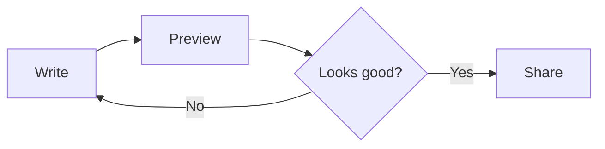

# Welcome to Markflow

*A tiny tour of everything markdown can do — right here, in this file.*

Tap **Preview** in the top bar to see this rendered. Tap **Edit** to come back and play.

---

## Headings

Use `#` through `######` for six levels of heading.

# H1 — The boldest
## H2 — Major sections
### H3 — Sub-sections
#### H4 — Quieter still

## Emphasis

You can make text **bold**, *italic*, ***both***, or ~~strikethrough~~.

Inline `code` sits nicely between words.

## Lists

**Bulleted:**

- Write in plain text
- Preview in one tap
- Share a clean `.md` copy

**Numbered:**

1. Open any markdown file
2. Read it beautifully
3. Edit without touching the original

**Task list:**

- [x] Open Markflow
- [x] Read this welcome note
- [ ] Write your first document

## Links and images

Visit [santiagoalonso.com](https://santiagoalonso.com) for more.


> Use absolute URLs for images — relative paths aren't supported yet.

## Blockquote

> "Markdown is a writer's shorthand for the web."
>
> — Every writer, eventually.

## Code blocks

Syntax highlighting is included. Specify a language after the opening fence.

```swift
struct Welcome: View {
    var body: some View {
        Text("Hello, Markflow")
            .font(.largeTitle)
    }
}
```

```js
const greet = (name) => `Hello, ${name}`
console.log(greet("Markflow"))
```

## Tables

| Feature          | Supported | Notes                          |
|------------------|:---------:|--------------------------------|
| GFM tables       | ✓         | Column alignment works         |
| Task lists       | ✓         | Checkbox renders green         |
| Mermaid diagrams | ✓         | Use ` ```mermaid ` fence       |
| Inline images    | ✓         | Absolute URLs only for now     |

## Diagrams



## Horizontal rule

Use three dashes on their own line for a divider:

---

## That's it

Delete everything here and start writing. Your words, your rules.

Made with care — [santiagoalonso.com](https://santiagoalonso.com)
