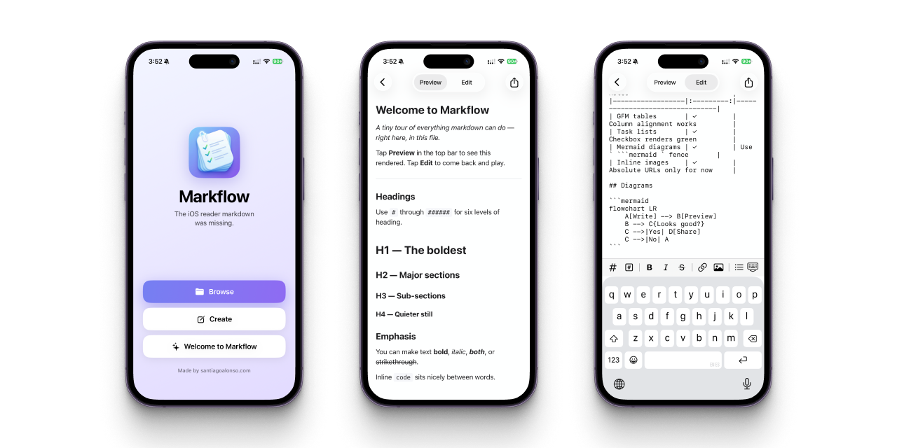

<p align="center">
  
</p>
<h1 align="center">Markflow</h1>
<p align="center">Simple on-the-go markdown reader and editor for iOS.</p>
<p align="center"><strong>Version 0.1.0</strong> · iOS 26 · SwiftUI</p>

<p align="center">
  <a href="https://apps.apple.com/us/app/markflow-markdown-reader/id6763440990">
    
  </a>
</p>

---

<p align="center">
  
</p>

---

Markflow is a native markdown reader and editor for iOS 26. Tap any `.md` file in Files, Mail, or Safari and it opens rendered: code blocks, mermaid diagrams, tables, inline images. Files open read-only by default and edits live in memory until you explicitly choose Save, Save as New File, or Share.

## How it works

Files open in read-only mode by default. Switch to Edit and changes live in memory until you explicitly Save, Save as New File, or Share. The rich-text toolbar above the keyboard covers bold, italic, headings, lists, links, images, code, and blockquotes. Pinch-to-zoom works in both modes: WKWebView zoom in Preview, font scaling in Edit.

## Build from source

Requires Xcode 26 and the iOS 26 simulator runtime.

```bash
cd Markflow
xcodegen generate
xcodebuild -project Markflow.xcodeproj -scheme Markflow \
  -destination 'platform=iOS Simulator,name=iPhone 16e' build
```

Or open in Xcode and press ⌘R:

```bash
open Markflow.xcodeproj
```

For a physical-device build, the bundle is signed under Team `QAMM2A6WRQ` (Apple Developer Program). Select your iPhone in Xcode's device picker and hit Run.

## Project layout

<details>
<summary>File tree</summary>

```
md-reader/
├── Markflow.xcodeproj/         # generated by xcodegen
├── project.yml                 # xcodegen config
├── Markflow/
│   ├── MarkflowApp.swift       # @main, WindowGroup { HomeView() }
│   ├── Info.plist              # CFBundleDocumentTypes for .md handler
│   ├── Assets.xcassets/        # AppIcon (1024) + HomeIcon (for in-app display)
│   ├── Resources/
│   │   ├── welcome.md          # Template shown on Create
│   │   ├── preview.html        # HTML template + CSS
│   │   ├── marked.min.js       # markdown -> HTML (40 KB)
│   │   ├── highlight.min.js    # syntax highlighting (125 KB)
│   │   ├── highlight-github.css
│   │   ├── highlight-github-dark.css
│   │   └── mermaid.min.js      # flowcharts (3 MB)
│   └── Views/
│       ├── HomeView.swift      # gradient home with Browse/Create CTAs
│       ├── DocumentView.swift  # nav bar with picker + share
│       ├── EditView.swift      # UITextView + markdown toolbar + pinch font scaling
│       └── PreviewView.swift   # WKWebView wrapper
```

</details>

## Known limitations

- Relative image paths in markdown (``) don't resolve. Use absolute URLs.
- No "Recents" list on the home screen (dropped when we replaced `DocumentGroup`).

## Support

User support: see [docs/support.md](docs/support.md) or email [hi@santiagoalonso.com](mailto:hi@santiagoalonso.com).

Bug reports and feature requests: [open an issue](https://github.com/madebysan/markflow/issues).

## Acknowledgements

Rendering libraries, vendored in `Markflow/Resources/`:

- [marked](https://github.com/markedjs/marked) for markdown parsing
- [highlight.js](https://github.com/highlightjs/highlight.js) for syntax highlighting
- [Mermaid](https://github.com/mermaid-js/mermaid) for diagrams and flowcharts

## License

[MIT](LICENSE)

---

Made by [santiagoalonso.com](https://santiagoalonso.com)
