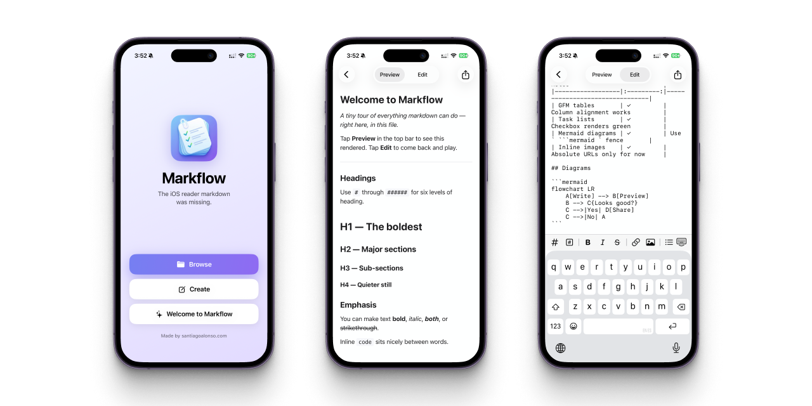

<p></p>

<h1>Markflow</h1>

<p>Simple on-the-go markdown reader and editor for iOS.</p>

<p><strong>Version 0.2.0</strong> · iOS 26 · SwiftUI</p>

<p>
  
  
  
</p>

<p>
  <a href="https://apps.apple.com/us/app/markflow-markdown-reader/id6763440990"></a>
</p>



Markflow is a native markdown reader and editor for iOS 26. Tap any `.md` file in Files, Mail, or Safari and it opens rendered: code blocks, mermaid diagrams, tables, inline images. Files open read-only by default and edits live in memory until you explicitly choose Save, Save as New File, or Share.

## How it works

Files open in read-only mode by default. Tap the floating eye/pencil glass button at the bottom to switch to Edit. Edits live in memory until you Save (writes to source), Save as New File (file picker), Share, or Export as PDF.

A floating Liquid Glass keyboard toolbar covers headings, bold/italic/strikethrough, links, images (PHPicker → saved sibling to your .md), task/bullet/numbered lists, blockquotes, inline code, code blocks, and rules. Pinch-to-zoom works everywhere: WKWebView zoom in Preview, font scaling in Edit. Swipe from the left edge of an open document to dismiss it.

Settings (gear in Home top-right, or in any document's ••• menu) covers:

- **Appearance** — System / Light / Dark
- **Theme** — 5 curated themes (Indigo, Forest, Sunset, Ocean, Graphite), each with light + dark accents
- **Text** — 6 fonts (System, Rounded, Charter, Monospace, iA Writer, JetBrains Mono); editor + preview size sliders
- **Behavior** — pick whether new files open in Edit or Preview
- **Recents** — last 4 opened files surface on Home; clearable from Settings

## Build from source

Requires Xcode 26 and the iOS 26 simulator runtime.

```bash
cd Markflow
xcodegen generate
xcodebuild -project Markflow.xcodeproj -scheme Markflow \
  -destination 'platform=iOS Simulator,name=iPhone 16e' build
```

Or open in Xcode and press ⌘R:

```bash
open Markflow.xcodeproj
```

For a physical-device build, the bundle is signed under Team `QAMM2A6WRQ` (Apple Developer Program). Select your iPhone in Xcode's device picker and hit Run.

## Project layout

<details>
<summary>File tree</summary>

```
md-reader/
├── Markflow.xcodeproj/         # generated by xcodegen
├── project.yml                 # xcodegen config
├── Markflow/
│   ├── MarkflowApp.swift       # @main, WindowGroup { HomeView() }
│   ├── Info.plist              # CFBundleDocumentTypes for .md handler
│   ├── Assets.xcassets/        # AppIcon (1024) + HomeIcon (for in-app display)
│   ├── Resources/
│   │   ├── welcome.md          # Template shown on Create
│   │   ├── preview.html        # HTML template + CSS
│   │   ├── marked.min.js       # markdown -> HTML (40 KB)
│   │   ├── highlight.min.js    # syntax highlighting (125 KB)
│   │   ├── highlight-github.css
│   │   ├── highlight-github-dark.css
│   │   └── mermaid.min.js      # flowcharts (3 MB)
│   └── Views/
│       ├── HomeView.swift      # gradient home with Browse/Create CTAs
│       ├── DocumentView.swift  # nav bar with picker + share
│       ├── EditView.swift      # UITextView + markdown toolbar + pinch font scaling
│       └── PreviewView.swift   # WKWebView wrapper
```

</details>

## Known limitations

- Relative image paths in markdown (``) don't resolve. Use absolute URLs.
- No "Recents" list on the home screen (dropped when we replaced `DocumentGroup`).

## Support

User support: see [docs/support.md](docs/support.md) or email [hi@santiagoalonso.com](mailto:hi@santiagoalonso.com).

Bug reports and feature requests: [open an issue](https://github.com/madebysan/markflow/issues).

## Acknowledgements

Rendering libraries, vendored in `Markflow/Resources/`:

- [marked](https://github.com/markedjs/marked) for markdown parsing
- [highlight.js](https://github.com/highlightjs/highlight.js) for syntax highlighting
- [Mermaid](https://github.com/mermaid-js/mermaid) for diagrams and flowcharts

Bundled fonts (SIL Open Font License), in `Markflow/Resources/fonts/`:

- [iA Writer Quattro S](https://github.com/iaolo/iA-Fonts) by iA Inc.
- [JetBrains Mono](https://github.com/JetBrains/JetBrainsMono) by JetBrains

## License

[MIT](LICENSE)

---

Made by [santiagoalonso.com](https://santiagoalonso.com)
